# Multiclass-Classification-on-Iris-Dataset

## Dataset Information

The data set contains 3 classes of 50 instances each, where each class refers to a type of iris plant. One class is linearly separable from the other 2; the latter are NOT linearly separable from each other.

Attribute Information:

sepal length in cm
sepal width in cm
petal length in cm
petal width in cm
class: -- Iris Setosa -- Iris Versicolour -- Iris Virginica

## Exploratory Data Analysis

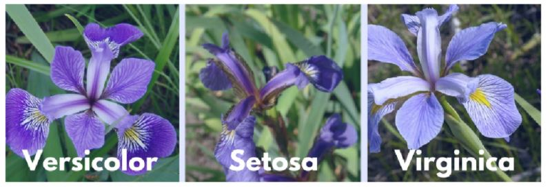

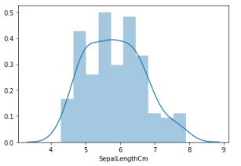

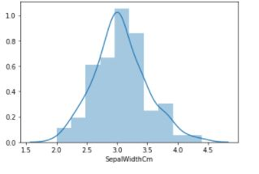

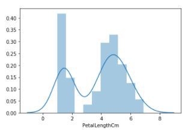

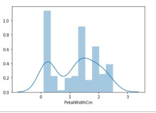

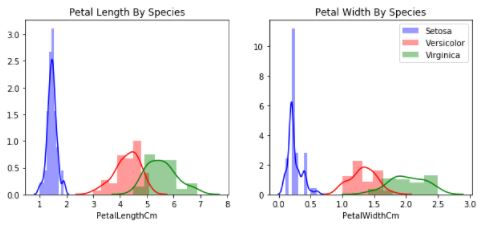

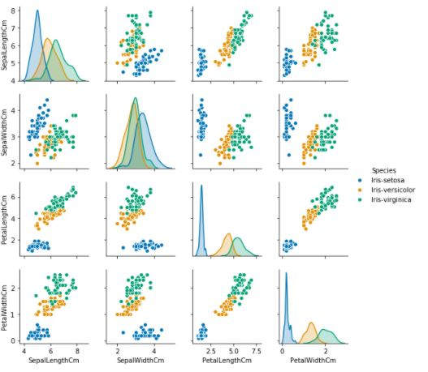

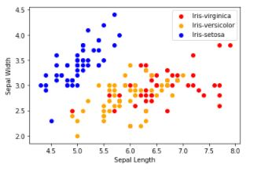

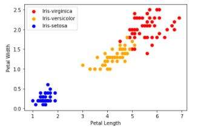

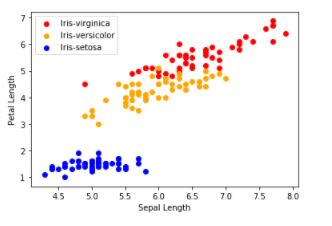

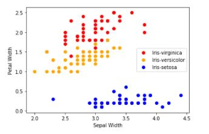

## Results:

### Logistic Regression

[[18  0  0]  
 [ 0  9  2]  
 [ 0  0 16]]  
 
 Accuracy:  95.55555555555556
 
 ### KNeighborsClassifier
 
 [[18  0  0]  
 [ 0  9  2]  
 [ 0  0 16]]  
 
 Accuracy:  95.55555555555556
 
 ### DecisionTreeClassifier
 
 [[18  0  0]  
 [ 0 10  1]  
 [ 0  3 13]]  
 
 Accuracy:  91.11111111111111
 
 ### GaussianNB
 
 [[18  0  0]  
 [ 0 10  1]  
 [ 0  2 14]]  
 
 Accuracy:  93.33333333333333
